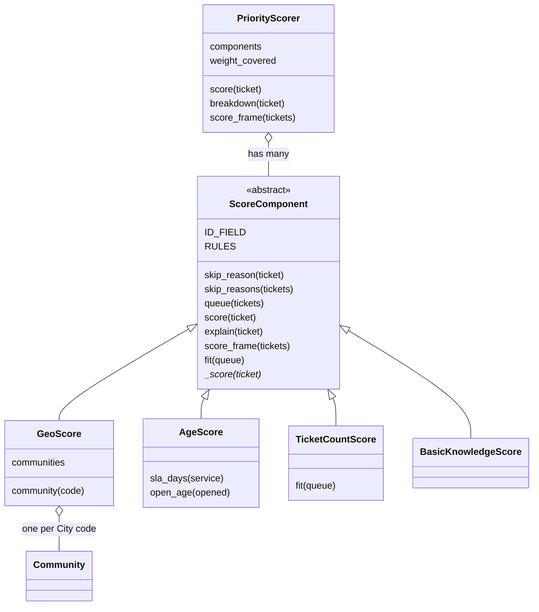
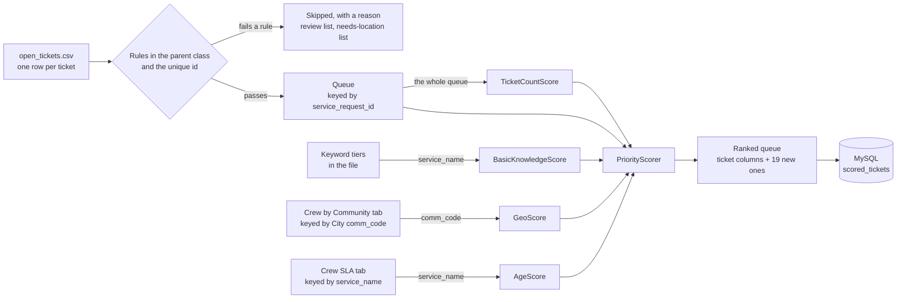

# Priority score

Everything about scoring is in this folder, `scoring/`:

| File | What it is |
|---|---|
| `priority_score.py` | The scorer. Every term of the formula is in this one file |
| `load_scored_tickets.py` | Scores the queue and writes it to MySQL |
| `schema.sql` | The two MySQL tables, `workforce` and `scored_tickets` |
| `migrate_to_workforce.sql` | Upgrade path if the DB still has the old `crew_pool` supply table |
| `requirements.txt` | What the two scripts need: pandas, openpyxl, the MySQL connector |
| `PRIORITY_SCORING.md` | This note: the formula, the rules, each term |
| [`SCORED_TICKETS.md`](SCORED_TICKETS.md) | The `scored_tickets` table, column by column |
| [`WORKFORCE.md`](WORKFORCE.md) | The shared `workforce` supply table |
| [`CREW_POOL.md`](CREW_POOL.md) | Note that the old supply table was retired |

Run from this folder:

```
pip install -r requirements.txt           # once
python priority_score.py                  # score and rank the open tickets
python priority_score.py --keywords       # the keyword report
mysql -u root -p -e "source schema.sql"   # build the database, once
python load_scored_tickets.py             # score, rank and load into MySQL
```

**The data is not in this folder.** The two scripts find it from their own location, so they also run from anywhere, for example `python scoring/priority_score.py` from the case folder.

| What | Where the scripts look |
|---|---|
| The two reference workbooks | `../data/`, beside this folder. The guide reads the same files |
| `open_tickets.csv` | `../data/` first, then `databricks/data/` at the repo root, which is where `main` keeps it |
| The small sample, used when there is no `open_tickets.csv` | `../data/` first, then `data/` at the repo root |

## The formula

Every open crew ticket gets one number. Higher means send a crew sooner.

```
priority = 0.40 × basic_knowledge + 0.25 × geo + 0.20 × age + 0.15 × ticket_count
```

Each term is a score from 0 to 1, so a term's weight is the most it can add. All four terms are in, so the highest possible priority is **1.0**.

| Term | Weight | Class | Looks at | Reads from |
|---|---|---|---|---|
| Basic knowledge | 0.40 | `BasicKnowledgeScore` | The words in the service name | `CRITICALITY_TIERS`, in the file |
| Geography | 0.25 | `GeoScore` | The ticket's community | `../data/311_service_type_reference.xlsx`, tab **Crew by Community** |
| Age | 0.20 | `AgeScore` | Time open against the deadline | `../data/crew_sla_reference.xlsx`, tab **Crew SLA** |
| Number of tickets | 0.15 | `TicketCountScore` | Same-day tickets for the same job | The queue being scored |

This weighted sum replaces the `severity × geography × age` draft in the guide ("How the score fits together").

## How the file is laid out

`priority_score.py` has eight numbered sections, in this order:

| # | Section | What is in it |
|---|---|---|
| 1 | Shared helpers | Reading a field, a date, a number from any kind of ticket |
| 2 | `ScoreComponent` | The parent: the ticket rules, the unique id, the hooks a term fills in |
| 3 | Basic knowledge | The keyword tiers, the keyword report, `BasicKnowledgeScore` |
| 4 | Geography | The density and percentile maths, `Community`, `GeoScore` |
| 5 | Age | `OpenAge`, `AgeScore` |
| 6 | Number of tickets | The count steps, `TicketCountScore` |
| 7 | The total | `PriorityScorer` |
| 8 | Command line | `python priority_score.py` |

It imports nothing else from the project. Three files were folded into it:

| Was | Now |
|---|---|
| `geo_score.py` (the case folder, on the `alvin` branch) | Section 4. The file is removed |
| `add_priority_column.py` (repo root, from `main`) | Sections 3 and 6: the tiers, `get_criticality_details()`, `get_volume_multiplier()` |
| `extract_keywords.py` (repo root, from `main`) | Section 3: the unnecessary-word list and `keyword_report()` |

The two root files were not moved into this folder. They are a teammate's files, at the repo root on `main`. The scorer does not read them, so **the tiers and the count steps now exist in two places**. Today they are identical (checked word for word). When one side changes a keyword, the other has to follow, or the root files should be retired.



- **The parent, `ScoreComponent`, is the gate.** It holds the ticket rules and the ticket id. Its `score()` checks the rules first and only then calls the term's own `_score()`. No term can score a ticket that fails a rule.
- **IS-A.** Each term is a `ScoreComponent`. It writes one method, `_score(ticket)`, returning 0 to 1.
- **HAS-A.** `PriorityScorer` holds a list of components and adds up `weight × score`. It doesn't know how any term is calculated.
- **`fit(queue)`** is called once with the whole queue before its tickets are scored. Only `TicketCountScore` uses it, because it compares a ticket with the others.
- **Weights** live in one place: `WEIGHTS` at the top of the file.

## Rules every ticket passes first (in the parent class)

They sit at the top of `ScoreComponent` as `RULES`, one line each, and run before any data is scored. Counts are from `open_tickets.csv`:

| # | Rule | Skipped when | Reason given | Tickets skipped |
|---|---|---|---|---|
| 1 | `status_description` is Open | It isn't | Not open | 0 |
| 2 | `is_crew_job` is TRUE | It is FALSE | Not a crew job | 30,450 |
| 3 | `closed_date` is empty | It has any date | Has a closed date | 2,764 |
| 4 | `has_location` is TRUE | It is FALSE | No location | 92 |
| 5 | `needs_review` is FALSE | It is TRUE | Waiting over 60 days: needs review | 17,684 |
| | **Left to score** | | | **5,934** |

- **The first rule a ticket fails is its reason.** A ticket counted under "No location" may also be over 60 days old.
- **A ticket that doesn't carry a field passes that rule.** The small sample has no `is_crew_job` column, so only rule 1 applies to it.
- **Flags are read as text**, so `TRUE`, `true`, `True`, `1` and `yes` are all true.
- **To change a rule,** edit or delete its line in `RULES`. Without rule 5 the queue is 23,618.

About rule 3: 2,764 crew jobs are marked Open but carry a closed date (269 of them from the last 60 days). The status never caught up, so they are treated as done.

### The ticket id

`service_request_id` is the unique key of a ticket (`ID_FIELD`).

- It is unique on all 1,936,033 tickets in the full export and all 56,924 in `open_tickets.csv`, with no blanks.
- In a table, a blank id is skipped ("No ticket id") and a repeat of an id already accepted is skipped ("Repeated ticket id"). One ticket can't be scored twice.
- Results are labelled by it: `ranked.loc["26-00582046"]` returns that ticket's row. The id column is still there too.

### Seeing what was skipped, and why

```python
from priority_score import ScoreComponent

why = ScoreComponent.skip_reasons(tickets)          # one reason per row, "" when it passes
held = tickets.assign(skipped_because=why)

held[held["skipped_because"] == "No location"]      # the list for a person to resolve
ScoreComponent.skip_reason(one_ticket)              # a single ticket: the reason, or None
```

### Crew jobs with no location (`has_location` = FALSE)

92 crew jobs have no location. In this file that means no community and no coordinates. 82 are Roads jobs (41 potholes). Only 9 are from the last 60 days: 3 water valve issues, 3 new cart requests, a manhole, a catch basin and a sidewalk.

**What we do: hold them, don't drop them and don't guess.**

1. **They are not scored.** A crew can't be sent to a job with no place, and any geography score for it would be invented. The floor would push a manhole to the bottom for the wrong reason.
2. **They go on a "needs location" list** (the snippet above). The open data never publishes an address: it is blank on every row, and the coordinates are the community's centre point. So the place has to come from the City's own 311 record, or a call back to the person who reported it.
3. **Once the ticket has a `comm_code` and `has_location` is TRUE, the next run scores it.** Nothing else changes.
4. **Work the list by danger, not by age.** The manhole and the catch basin come first. 83 of the 92 are over 60 days old and would be on the review list anyway.

If the team would rather score them, delete the `has_location` line from `RULES`. They then get the geography floor (0.3) and `community_found` = False.

## How the data flows



**No tier, SLA, geo_score or count is typed in per ticket.** Each ticket carries only its own facts. The scorer works out the rest:

| The ticket's column | Looks up | In | Comes out as |
|---|---|---|---|
| `service_request_id` | – (the ticket's key) | – | The row label |
| `service_name` | The words in the name | The keyword tiers | `criticality_tier`, `criticality_keywords`, `basic_knowledge_score` |
| `comm_code`, then `comm_name` | Residents, business licences, area | Crew by Community tab | `population`, `business_licences`, `area_km2`, `geo_score` |
| `service_name` | The deadline, `age_deadline_days` | Crew SLA tab | `sla_days` |
| `requested_date` | – (compared with the clock) | – | `open_days`, `open_hours` |
| `service_name` + `requested_date` + `latitude`, `longitude` | Tickets for the same job | The rest of the queue | `same_day_ticket_count`, `ticket_count_score` |

Change a keyword or a number in a source and the next run uses it. A ticket whose type or community isn't found gets a default, and the output says so (`keyword_found`, `sla_found`, `community_found`).

### With `open_tickets.csv`

`python priority_score.py` reads it, applies the rules, scores and ranks what's left, and prints how many tickets each rule skipped. Add `--out ranked.csv` to save the result. Where there is no `open_tickets.csv` in either place it looks, the script falls back to the small sample.

`python load_scored_tickets.py` does the same and writes the ranked queue to MySQL as a new run.

**Is the file enough?**

| For | Needs | In the file? |
|---|---|---|
| The rules | `is_crew_job`, `closed_date`, `has_location`, `needs_review`, `status_description`, `service_request_id` | Yes, all six |
| `BasicKnowledgeScore` | `service_name` | Yes. 39 of the 5,934 queued jobs are of a type with no keyword and get tier 1 by default |
| `GeoScore` | `comm_code` or `comm_name` | Yes. Every one of the 5,934 queued jobs has a code, and every code is in the community table |
| `AgeScore` | `service_name`, `requested_date` | Yes. No blanks, and all 65 crew types in the queue have an SLA |
| `TicketCountScore` | `service_name`, `requested_date`, `latitude` + `longitude` | Yes, but the coordinates are the community's centre point, so "same place" means "same community". `address` is empty on every row |
| The database | `crew_pool`, `work_category`, `call_confidence` (metadata columns on `scored_tickets`; supply is `workforce`) | Yes. The small sample has none of the three, so the loader refuses it |

**The file's own age columns are a different calculation.** `open_tickets.csv` already carries `days_waiting`, `normal_days`, `age_ratio` and `waiting_bonus` from the backend steps. Those measure against `normal_days` (the type's p90, held between 1 and 30 days). `AgeScore` measures against the City's SLA. The scorer leaves the file's columns alone and writes its own under different names:

| | Backend columns in the file | `AgeScore` columns |
|---|---|---|
| Time waiting | `days_waiting` (to `as_of_date`) | `open_days`, `open_hours` (to the clock) |
| Deadline | `normal_days` (p90, 1 to 30) | `sla_days` (published SLA, else p90) |
| Ratio | `age_ratio` | `sla_ratio` |

The deadline differs for 56 of the 65 crew types in the queue. Potholes: 6 days there, 20 here. Graffiti: 23 there, 5 here. The two disagree on whether a job is late for 1,121 of the 5,934 jobs. The team should pick one before the scores are compared.

**Using it from a `backend/` step:**

```python
import sys
sys.path.insert(0, str(CASE_FOLDER / "scoring"))    # the folder priority_score.py is in

from priority_score import PriorityScorer

ranked = PriorityScorer().score_frame(open_tickets)    # the rules run inside
```

## Using it

```python
from priority_score import PriorityScorer

scorer = PriorityScorer()          # all four terms

ticket = {"service_request_id": "26-00700001",
          "service_name": "Roads - Pothole Maintenance",
          "comm_code": "BLN",
          "requested_date": "2026-09-23"}

scorer.score(ticket)               # 0.770
scorer.breakdown(ticket)           # every input behind that number (below)

scorer.score({**ticket, "is_crew_job": False})        # None: the parent skipped it
scorer.breakdown({**ticket, "is_crew_job": False})    # {"skipped_because": "Not a crew job"}

ranked = scorer.score_frame(tickets).sort_values("priority", ascending=False)
ranked.loc["26-00582046"]          # one ticket, by its id
```

`breakdown()` for that ticket, scored on its own at 4:30 pm on Oct 3, 2026:

| Field | Value | Meaning |
|---|---|---|
| `keyword_found` | True | False = no keyword in the service name, so it got tier 1 by default |
| `criticality_tier` | 4 | 4 = safety, 3 = disruption, 2 = nuisance, 1 = routine |
| `criticality_keywords` | pothole | The word or words that set the tier |
| `basic_knowledge_score` | 1.0 | The tier's multiplier |
| `community_found` | True | False = the community is blank or not in the table, so it got the floor |
| `population` | 25,880 | Residents of the community (2021 census) |
| `business_licences` | 861 | Business licences in the community |
| `area_km2` | 2.94 | Its area |
| `geo_score` | 0.993 | Beltline's geography score |
| `open_days` | 10 | Whole days open |
| `open_hours` | 16 | Hours on top of the whole days |
| `sla_days` | 20.0 | The pothole SLA (14 business days) |
| `sla_found` | True | False = the type isn't in the SLA table, so it got the 14-day default |
| `sla_ratio` | 0.534 | 10 d 16 h ÷ 20 d |
| `overdue` | False | True once `sla_ratio` passes 1 |
| `age_score` | 0.534 | |
| `same_day_ticket_count` | 1 | Tickets in the queue for the same job, day and place, this one included |
| `ticket_count_score` | 0.1 | 1 ticket = 0.10 |
| `priority` | 0.770 | 0.40 × 1.0 + 0.25 × 0.993 + 0.20 × 0.534 + 0.15 × 0.1 |

`score_frame()` returns the tickets that pass the rules, labelled by ticket id, with those 19 columns added.

**A ticket can be** a dict, a DataFrame row, a namedtuple from `itertuples()`, or any object with the fields as attributes. They all score the same.

## BasicKnowledgeScore (weight 0.40)

**The question it answers:** how serious is this kind of job? It reads the words in the ticket's `service_name` and looks them up in the team's criticality matrix, `CRITICALITY_TIERS` (section 3 of the file).

| Tier | Meaning | Score | Example keywords | Crew types | Jobs in the queue |
|---|---|---|---|---|---|
| 4 | Critical: safety and liability | 1.00 | pothole, ice, snow, manhole, hydrant, sewage, damage | 20 | 622 (10.5%) |
| 3 | Major: operational disruption | 0.70 | sidewalk, signs, traffic, tree, water, sewer, bus | 48 | 4,011 (67.6%) |
| 2 | Moderate: nuisance and sanitation | 0.40 | graffiti, cart, garbage, backlane, encampment | 21 | 1,178 (19.9%) |
| 1 | Insignificant: aesthetic and routine | 0.10 | mowing, irrigation, roadside, cemetery, damaged | 18 | 123 (2.1%) |

- **The highest tier among the matched words wins.** "WATS - Sewage Back-up" has `sewage` (tier 4) and `back` (tier 2), so it is tier 4.
- **A name with no keyword gets tier 1**, and `keyword_found` is False. That is 4 crew types with 39 queued jobs: Parks - Maintenance - GIS (19), Stewardship of City Owned Land (14), Roads - BIA Maintenance (4), Facility Mgmt - FMCCC (2).
- **`criticality_keywords`** lists only the words of the winning tier.
- **Same result as the original.** On every service type in `open_tickets.csv` the score equals `get_criticality_multiplier()` in `add_priority_column.py` on `main`.

### The keyword report

`python priority_score.py --keywords` prints every keyword in the 107 crew service types by tier, with how many types use it. It is the report `extract_keywords.py` was written to make. That script can't run as committed: it reads `311_service_type_reference.csv`, which is on no branch. This one reads the service names from the Crew SLA tab.

From code: `keyword_report(service_names)` returns the same thing as a table. Words in `UNNECESSARY_WORDS` ("maintenance", "roads", "gis" and 47 more) are left out.

What it shows today:

- **129 keywords.** Tier 4 has 18, tier 3 has 56, tier 2 has 35, tier 1 has 18.
- **Two words have no tier yet:** `glenmore` and `noise`.
- **One keyword is never used:** `collapse` (tier 4) is in no crew service name.
- **Six types are made only of unnecessary words,** so no tier can ever match them. Four of them have queued jobs: the 39 above.

### Things to know

- **Two-thirds of the queue is tier 3.** For those 4,011 jobs this term is a tie, and the other terms decide the order.
- **`damaged` is tier 1 (0.10), not tier 4.** It used to lift "Roads - Signs - Missing - Damaged" into tier 4; that type is now tier 3 via `missing` / `signs` / `sign`. The separate keyword `damage` (without the final d) remains tier 4.
- **A generic word can lift a type.** "Parks - Weed Control Issues" is tier 3 because `control` is a tier-3 keyword, although `weed` is tier 1.

These come from the keyword lists, so they are fixed by editing `CRITICALITY_TIERS`.

## GeoScore (weight 0.25)

**The question it answers:** if this job sits open, how many people are affected? Method and reasoning are in `../data/311_service_type_reference_GUIDE.md`, "How geo_score is calculated". The maths is `density()`, `percentile()` and `geo_score_from_percentiles()` in section 4 of the file:

```
resident_density = population_2021 / area_km2
business_density = business_licences / area_km2
percentile       = rank among the communities that have a value, 0 to 1
exposure         = MAX(resident_percentile, business_percentile)
geo_score        = floor + (1 − floor) × exposure          (floor = 0.3)
```

- **Rebuilt from the raw counts.** The class reads `population_2021`, `business_licences` and `area_km2` and does the maths itself, so a refreshed community table works without recalculating in Excel. The result equals the workbook's own `geo_score` column on all 316 communities.
- **Floor.** `GeoScore(floor=0.7)` changes it. With the weighted sum, the floor decides how much of the 0.25 every ticket gets for free (0.075 at 0.3).

### Communities are keyed by the City's code

There is no need to invent an id. The City of Calgary already gives every community a **3-character code**: `BLN` is Beltline, `DNC` is Downtown Commercial Core. The same code is on three of our sources:

| Source | Column |
|---|---|
| 311 tickets | `comm_code` |
| 2021 Federal Census by Community (City open data) | `COMMUNITY_CODE` |
| Crew by Community tab | `comm_code` |

- **316 codes, all unique,** with one name per code. 313 are in the census. The other 3 (`ABT`, `01I`, `12I`) have tickets but no census boundary, so no area and the floor score.
- **Every ticket code is in the table,** apart from one closed ticket in the full export (`11A`).
- **A code listed twice in the community table stops the run** with an error naming it.

Call a community by its code and its numbers come back:

```python
geo = GeoScore()

c = geo.community("BLN")
c.name                  # "BELTLINE"
c.population            # 25880.0
c.business_licences     # 861.0
c.area_km2              # 2.942846
c.resident_density      # 8794.2 per km²
c.geo_score             # 0.993

geo.communities         # the whole table, one row per code
geo.score({"comm_code": "BOW"})     # 0.733
geo.score("somewhere else")         # 0.3 (floor)
```

| code | name | population | business_licences | area_km2 | geo_score |
|---|---|---|---|---|---|
| BLN | BELTLINE | 25,880 | 861 | 2.943 | 0.993 |
| DNC | DOWNTOWN COMMERCIAL CORE | 8,225 | 867 | 1.329 | 1.000 |
| MNI | MANCHESTER INDUSTRIAL | – | 876 | 4.573 | 0.961 |
| CRA | CRANSTON | 20,850 | 22 | 8.256 | 0.611 |

- **Finding a ticket's community.** It tries the ticket's `comm_code` first, then `comm_name`, then `community`. A name works anywhere a code does, and matching ignores case and spacing.
- **Blank population** means no residents were counted there in 2021. That is 110 of the 316: industrial and business areas, parks, communities built after 2021, and residual land.

**Workbook issue to fix:** on the **Crew by Community** tab, the crew ticket columns (D to G, and `crew_2026_per_1000_people`) show `#REF!`. They sum from a "Pivot Data (Crew)" tab that is no longer in the workbook. `GeoScore` doesn't use those columns.

## AgeScore (weight 0.20)

**The question it answers:** how much of its deadline has this ticket used up?

```
time open = now − requested_date                 (machine clock, in days and hours)
sla_ratio = time open ÷ SLA for the service type
age_score = MIN(sla_ratio ÷ CAP, 1)              (CAP = 1.0)
```

So 0 is a ticket opened just now, 0.5 is halfway to its deadline, and 1.0 is at or past its deadline.

**The SLA** is `age_deadline_days` on the Crew SLA tab, the column built for this:

- 85 types: the City's published standard-tier SLA, in calendar days.
- 22 types: no published SLA, so the type's observed p90 days-to-close.

**Time open** comes back in days and hours:

```python
age = AgeScore().open_age("2026-09-23")
age.days, age.hours        # (10, 16)
age.total_hours            # 256.5
str(age)                   # "10d 16h"
```

**`now`** is the machine clock at the moment of scoring. `open_tickets.csv` is a snapshot from Oct 2, 2026 (`as_of_date`), so on a later day `open_days` runs ahead of the file's `days_waiting`. To score as of the snapshot, fix the clock: `AgeScore(now="2026-10-02")`.

Worked examples, scored at 4:30 pm on Oct 3, 2026:

| Service type | Opened | Time open | SLA (days) | sla_ratio | age_score |
|---|---|---|---|---|---|
| Roads - Pothole Maintenance | Sep 23 | 10d 16h | 20 | 0.53 | 0.53 |
| Roads - Signs - Missing - Damaged | Sep 23 | 10d 16h | 30 | 0.36 | 0.36 |
| WRS - Waste - Residential | Oct 1 | 2d 16h | 3 | 0.90 | 0.90 |
| WATS - Sewage Back-up | Oct 3, 3:30 pm | 0d 1h | 0.08 (2 hours) | 0.52 | 0.52 |
| WATS - Water Meter Issues | Sep 23 | 10d 16h | 55 (p90) | 0.19 | 0.19 |
| A type not in the SLA table | Sep 23 | 10d 16h | 14 (default) | 0.76 | 0.76 |

### Decision for the team: how much should age separate tickets?

As of Oct 2, 2026, with `CAP = 1.0`:

| Queue | Jobs | Get the top age score of 1.0 |
|---|---|---|
| Every open crew ticket | 26,518 | 89% |
| The scored queue (after the five rules) | 5,934 | 53% |

Leaving the over-60-day tickets to the review list does most of the work: in the scored queue the age term separates nearly half the jobs. The other half are past their SLA and tie at 1.0, so the other three terms decide their order. That keeps the score from sliding back into oldest-first, which is what the guide asked for. If the team wants age to keep separating overdue jobs, there are two ways:

| Option | Effect |
|---|---|
| Raise `CAP` | Overdue jobs keep climbing until `CAP` × their SLA |
| Rank `sla_ratio` across the queue (a percentile, like `geo_score`) | No ties. Needs the whole queue, not one ticket |

Either way, sort ties by time open, longest first. `python priority_score.py` already does.

### Things to know

- **Dates have no time of day.** The export's `requested_date` is a date, so time open is counted from midnight of that day. A live feed with real timestamps needs no code change.
- **Most SLAs are investigate or respond clocks, not fix clocks.** A pothole's 20 days is the time to assess it, not to fill it. See the About tab of `crew_sla_reference.xlsx`.
- **Hour-level SLAs** are stored in days: 2 hours is 0.08, 36 hours is 1.5. With date-only data, these tickets are overdue by the next morning.
- **The urgent tier isn't used.** `sla_urgent_hours` (2 h hydrant emergencies, 4 h stop signs) needs a per-ticket urgency flag, and the tickets don't carry one.
- **A service type listed twice in the SLA table stops the run** with an error naming it.

## TicketCountScore (weight 0.15)

**The question it answers:** how many tickets report this same job? Several people reporting one problem on one day is a sign it is real and in the way.

Two tickets are the same job when they have the same **service type**, the same **day**, and the same **place**. The place is the latitude and longitude rounded to 3 decimals, about 100 m. A ticket with no coordinates falls back to its `point` text.

| Tickets for the same job | Score | Jobs in the queue |
|---|---|---|
| 1 | 0.10 | 4,777 (80.5%) |
| 2 | 0.20 | 676 (11.4%) |
| 3 | 0.35 | 210 (3.5%) |
| 4 to 6 | 0.70 | 124 (2.1%) |
| 7 or more | 1.00 | 147 (2.5%) |

The steps are `VOLUME_STEPS` and the lookup is `get_volume_multiplier()`, both from `add_priority_column.py` on `main`. On every one of the 56,924 open tickets the count equals that file's `add_volume_multiplier_column()`.

The queue has 447 groups of two or more. The largest:

| Day | Service type | Community | Tickets |
|---|---|---|---|
| Oct 1 | WRS - Debris in Backlane | Falconridge | 53 |
| Sep 24 | Roads - Temporary Sign Removal | Glenbrook | 20 |
| Sep 30 | Corporate - Graffiti Concerns | Hillhurst | 14 |

### Things to know

- **Today "same place" means "same community".** The export's coordinates are the community's centre point, not the job's address. Counting by community gives the same number on every ticket. With real coordinates the same code would count within about 100 m.
- **It counts inside the queue being scored.** A ticket the rules skipped is not counted. 12 queued tickets have a same-day sibling with a closed date, and that sibling no longer adds to their count.
- **Every ticket in a group gets the group's score.** The 53 Falconridge backlane tickets each score 1.00 on this term, which lifts each of them from 0.562 to 0.697. They are still 53 separate jobs in the ranking.
- **Same day, whatever the time.** Two tickets opened at different times on one day are grouped. The original compares the date text exactly, which gives the same result on this date-only data.
- **A ticket scored on its own counts as 1.** `score(ticket)` has no queue to count in. After `score_frame(tickets)`, `breakdown(ticket)` uses that queue's counts.
- **Four in five tickets are alone** and get 0.10, so this term mostly changes the order among the other fifth. Of the top 100 tickets, 93 are the same with or without it.

## What is set in the code, and how to change it

The per-ticket values are worked out, never typed in. These are the only fixed choices, each in one place:

| Setting | Where | Now | To change it |
|---|---|---|---|
| Weights | `WEIGHTS`, top of the file | 0.40 / 0.25 / 0.20 / 0.15 | Edit the one line |
| Ticket rules | `ScoreComponent.RULES` | The five rules above | Edit or delete a line |
| Ticket key | `ScoreComponent.ID_FIELD` | `service_request_id` | Edit the one line |
| Ticket file | `TICKETS`, top of the file | `open_tickets.csv`, in `../data/` or else `databricks/data/` | `python priority_score.py other.csv` |
| Tiers, keywords and multipliers | `CRITICALITY_TIERS`, section 3 | 4 tiers, 128 keywords, 1.00 / 0.70 / 0.40 / 0.10 | Edit the lists |
| Words the keyword report skips | `UNNECESSARY_WORDS`, section 3 | 50 words | Edit the list |
| Community table | Top of `GeoScore` | Crew by Community tab | `GeoScore(communities=my_rows)` |
| Community key | `GeoScore.CODE_COL` | `comm_code` | Edit the one line |
| Floor | `FLOOR`, section 4 | 0.3 | `GeoScore(floor=0.7)` |
| SLA table | Top of `AgeScore` | Crew SLA tab | `AgeScore(sla=my_rows)` |
| Which column is the deadline | `AgeScore.SLA_DAYS_COL` | `age_deadline_days` | Edit the line, or subclass |
| SLA for a type not in the table | `AgeScore.DEFAULT_SLA_DAYS` | 14 (the table's most common SLA) | Edit the line, or subclass |
| Where the age score tops out | `AgeScore.CAP` | 1.0 (at the deadline) | Edit the line, or subclass |
| Same-day count steps | `VOLUME_STEPS`, `VOLUME_ALONE`, section 6 | 2 → 0.20, 3 → 0.35, 4 → 0.70, 7 → 1.00, alone 0.10 | Edit the two lines |
| How close is "the same place" | `TicketCountScore.PLACE_DECIMALS` | 3 decimals, about 100 m | Edit the line, or subclass |
| Ticket column names | `SERVICE_FIELDS`, `OPENED_FIELDS`, `COMMUNITY_FIELDS`, `LATITUDE_FIELDS`, `LONGITUDE_FIELDS`, `POINT_FIELDS` | The names in `open_tickets.csv` | Add the new name to the tuple |

Three ways to point a class at different data, smallest first:

1. **Same layout, different file or tab:** edit `SOURCE`, `SHEET` and the column names at the top of the class.
2. **API or database:** replace the body of `load_source()`.
3. **A table you already have:** pass it in, as a DataFrame or a list of dicts.

   ```python
   GeoScore(communities=my_community_rows)
   AgeScore(sla=my_sla_rows)
   ```

A subclass changes a setting without touching the original:

```python
class PatientAge(AgeScore):
    CAP = 5
```

## Adding or changing a term

1. Write a class that extends `ScoreComponent`, with a `name`, a `weight` from `WEIGHTS`, and `_score(ticket)` returning 0 to 1. The parent has already checked the rules by the time it is called.

   ```python
   class WeatherScore(ScoreComponent):
       name = "weather"
       weight = WEIGHTS["weather"]

       def _score(self, ticket) -> float:
           return ...   # 0 to 1
   ```

2. If the term compares a ticket with the rest of the queue, override `fit(queue)` and keep what you counted. `TicketCountScore` is the example.
3. Add it to the default list in `PriorityScorer.__init__`, and keep the weights adding up to 1.
4. Optional: override `_explain()` to add columns to the breakdown. It must include `<name>_score`. Pick column names the ticket file doesn't already use.
5. To store a new column, add it to `schema.sql` and to `COLUMNS` in `load_scored_tickets.py`.

## What happens with bad data

A ticket that fails a rule is skipped with a reason. A ticket that passes never raises: a field that is missing or unreadable falls back to the lowest score for that term, and the `_found` columns show where that happened.

- **`BasicKnowledgeScore`:** a service name that is blank or has no keyword gets tier 1 (0.10) and `keyword_found` False.
- **`TicketCountScore`:** a ticket with no readable date, or no coordinates and no `point`, counts as 1 (0.10).

For the other two terms:

| What comes in | GeoScore | AgeScore |
|---|---|---|
| Field missing, blank, `None` or `NaN` | Floor (0.3), `community_found` False | Score 0; `open_days`, `sla_ratio`, `overdue` are empty |
| Community not in the table | Floor (0.3), `community_found` False | – |
| `comm_code` wrong but `comm_name` right | Uses the name | – |
| Service type not in the SLA table | – | `DEFAULT_SLA_DAYS` (14), `sla_found` False |
| Date as text in any common format, `datetime`, `date`, pandas or numpy timestamp | – | All read the same |
| Date that can't be read (`"garbage"`, a bare number) | – | Score 0 |
| Open date in the future | – | Counts as just opened (0) |
| Date with a timezone | – | Converted to local time |
| Empty ticket `{}`, or an empty table | Floor / empty result with the columns | 0 / empty result with the columns |
| Numbers stored as text, `#REF!` cells in the source table | Read as numbers / treated as blank | Same |

Setup mistakes do raise: a missing source file, an unreadable `now`, or a key listed twice in a lookup table.

## What it was checked against

**The scorer (106 checks):**

- **Same as the originals.** The tiers, keywords and multipliers are word for word those in `add_priority_column.py` on `main`, and the unnecessary words those in `extract_keywords.py`. The basic knowledge score equals the original on all 369 service types in `open_tickets.csv`. The same-day count equals the original on all 56,924 open tickets.
- **GeoScore:** equals the workbook's `geo_score` column on all 316 communities (largest difference 0), and the eight worked examples in the guide.
- **Rules:** the counts per rule match a separate count done straight from the columns, and a term's `_score()` is never called for a ticket that fails a rule.
- **Ids:** the scored queue has 5,934 rows and 5,934 different ids.
- **The total:** `priority` equals the formula on all 5,934 tickets and stays between 0 and 1. None of the file's 36 columns is overwritten.
- **Stands alone:** the file imports nothing else from the project.

**To the database (37 checks, on a throwaway database built from `schema.sql`):**

- Every one of the 5,934 rows arrives with the same values the scorer produced, in the scorer's order.
- MySQL itself recomputes the formula, the count steps, the same-day count and the tier score from the stored rows, and agrees on every row.
- The loader refuses an unknown crew pool, a run id that exists, a run with one bad row, and the small sample. Each time nothing is written.

**Speed:** the rules take 0.2 seconds on 56,924 tickets, and scoring the queue on all four terms takes 0.5.
